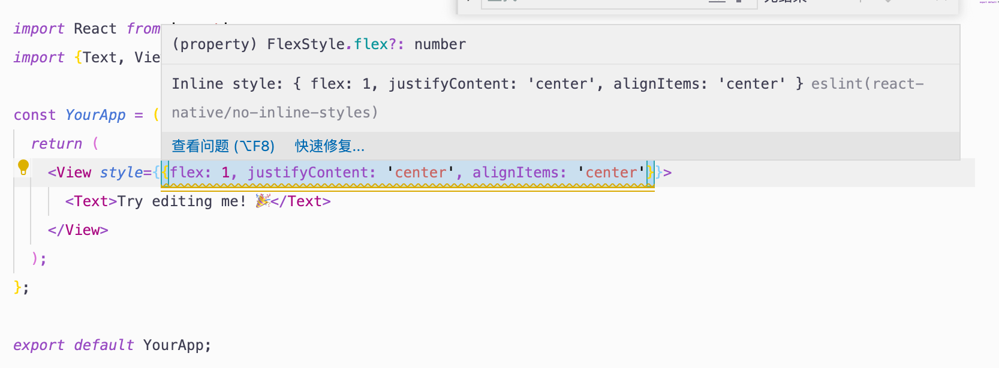
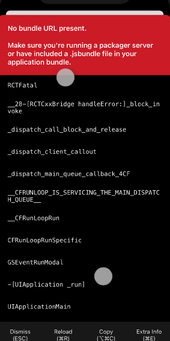

# RNWebviewDemo

## Why choosing React Native?
I also studied Flutter but `dart` has a higher cost of study.
For I'm familiar with web technology(js, html, css, vue), So I first found a way to open a 'webview', then I can write web page.
After confirming that it's feasible, I began to learn how to use React Native's UI components to develop pages, but found it so many 'Error Messages'😂,
it would took much more time to finish this demo. So I finally turn to use `webview` to open a web page.


## About the plugins
`react-native-webview`: Provides a way to open a web page.

`react-navigation`: It can help to develop page switching function.
Time is limited, and I'm not actually doing anything with it, just opening a page.

## Project setup
> You need to run a local server in H5 project first.
> https://github.com/Jupiterice/simple-demo

```bash
# 1. install node_modules
yarn install

# 2. local environment 
cd ./ios && pod install

# 3. run ios simulator
yarn ios
```

#### Records of development

1. In the default demo,  `app.js` uses the type declaration syntax and causes error hint.
   
   Add vscode setting: 
    ```
        "javascript.validate.enable": false
    ```
    To allowed type declarations in JS files without actively parsing into TS syntax.	
	
2. eslint warnning for inline style.
   
    

	[react-native系列(4)入门篇：在VSCode中配置ESLint(代码检测工具)](https://blog.csdn.net/zeping891103/article/details/85923084)
	
3. Boot exception: a problem with the VPN agent on😭.
    

4. Some general errors: 
    https://blog.csdn.net/weixin_42336002/article/details/80922981

5. Scrolling events calculate correctly in Browser，error in React Natve.
    - `rem` adaptive related problems，calculate in js forget to multiply by the scaling factor
    - other documnets:

        https://ld246.com/article/1498446273352
        http://www.voidcn.com/article/p-uoneovpy-but.html
        https://developer.mozilla.org/en-US/docs/Web/API/Document/scroll_e